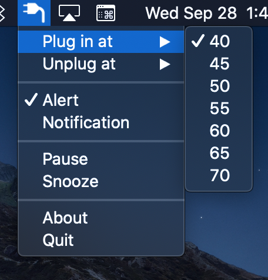
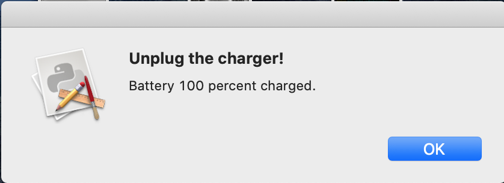

# ChargeMon

Simple macOS StatusBar app to monitor battery charge status and remind you to unplug your Mac when the battery is sufficiently charged

# Overview

Very simple app -- can toggle between alert or notification.  No other settings.

Sample alert:

## Installation

- clone the repo
- cd into the repo directory
- create a virtual environment and activate it
- python3 -m pip install -r requirements.txt
- python3 setup.py py2app
- Copy dist/chargemon.app to /Applications

## Credits

Inspired by this [tweet](https://twitter.com/mathsppblog/status/1462706686058246151) by [@mathsppblog](https://twitter.com/mathsppblog).

## License

MIT License